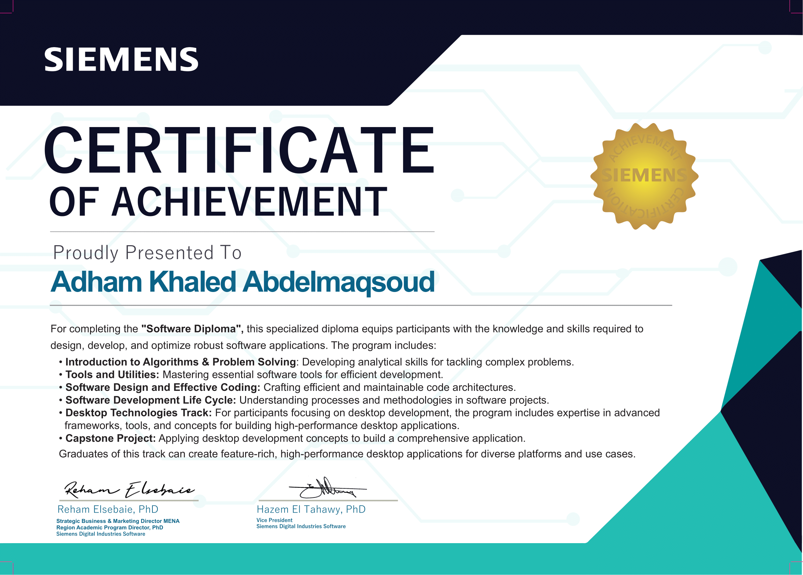

# Siemens Software Diploma

This repository documents my **successful completion of the Software Diploma** at  
**Siemens Digital Industries Software**.

It contains hands-on labs, assignments, problem-solving exercises, and project work completed throughout the diploma, demonstrating applied knowledge in **software engineering, algorithms, system design, and desktop technologies**.

---

## 🎓 Certificate

---

## 📘 Diploma Overview

The Software Diploma at Siemens Digital Industries Software is an intensive program focused on building strong **engineering fundamentals** combined with **real-world, hands-on practice**.

### Key Areas Covered

### 1️⃣ Effective Coding
- Best coding practices
- Object-Oriented Programming (OOP)
- Memory optimization
- Performance evaluation

### 2️⃣ Software Utilities
- Git version control
- Build processes
- Linux tools and environment

### 3️⃣ Problem Solving & Algorithms
- Data Structures (STL)
- Sorting and searching algorithms
- Binary search
- Backtracking
- Dynamic programming
- Extensive hands-on problem solving (LeetCode-style)

### 4️⃣ Software Design
- Programming paradigms
- SOLID principles
- Design patterns
- System design fundamentals
- UI/UX basics

### 5️⃣ Software Development Life Cycle (SDLC)
- Agile methodology
- Complete software development lifecycle
- Requirement analysis, implementation, testing, and delivery

### 6️⃣ Desktop Technologies
- Compilers
- Qt framework
- Databases
- High-performance computing concepts

---

## 🧩 Capstone Project

### Asset Tracker System

As the capstone project, my team and I developed an **Asset Tracker System**, a web-based application built using the Spring Framework, that enables efficient management and tracking of organizational assets.

**Project highlights:**
- Real-world problem solving
- Handling evolving requirements
- Scalable and maintainable design
- Application of software design principles and best practices

This project served as a comprehensive application of the concepts learned throughout the diploma.

---

## 📂 Repository Contents

This repository includes:
- Hands-on labs and exercises
- Data Structures & Algorithms implementations
- Problem-solving practice
- Diploma-related assignments
- Capstone project requirments PDF

